# mini-Neptun:
## 1. Célkitűzés
Az alkalmazás célja, hogy a diákok interneten keresztül intézhessék a tárgyfelvételeiket.
## 2. Követelményanalízis
### 2.1. Funkcionális követelmények:
#### Vendégek számára elérhető funkciók:
 * Vendégként csak a login oldal tekinthető meg.

#### Hallgatók számára elérhető funkciók:
 * Hallgatóknak lehetőségük van a login oldalon bejelentkezni.
 * Hallgatóknak lehetőségük van szerkeszteni a profiljukat.
 * Hallgatók jelentkezhetnek az oktatók által kiírt tárgyak valamely kurzusára.
 * Hallgatók leadhatnak egy már felvett tárgyat.
 * Két hallgató cserélhet egymással azonos tárgyhoz tartozó kurzust.

#### Oktatók számára elérhető funkciók:
 * Oktatóknak lehetőségük van a login oldalon bejelentkezni.
 * Oktatóknak lehetőségük van szerkeszteni a profiljukat.
 * Oktatóknak lehetőségük van új tárgyak kiírására.
 * Oktatóknak lehetőségük van már létező, általuk létrehozott tárgyak adatainak szerkesztésére (kredit, leírás, webcím, stb.).
 * Oktatóknak lehetőségük van egy tárgyhoz kurzusok felvételére.
 * Oktatóknak lehetőségük van kurzusok adatainak szerkesztésére (férőhely, helyszín, időpont, megjegyzés, leírás, stb.).
 * Oktatóknak lehetőségük van egy tárgy kurzusaira való jelentkezés lezárására.		

#### Adminok számára elérhető funkciók:
 * Adminak lehetősége van a login oldalon bejelentkezni.
 * Admin szerkesztheti a profilját.
 * Admin rögzíthet az alkalmazásba új felhasználókat

### Nem funkcionális követelmények:
 * Felhasználóbarát, ergonomikus elrendezés és kinézet.
 * Gyors működés.
 * Jelszavak biztonságos tárolása.
 * Funkciókhoz való hozzáférés elött jogosultság vizsgálat.
 
### 2.2. Szakterületi fogalomjegyzék

### 2.3. Használatieset-modell
* **Vendég:** a bejelentkezési oldalon kívül más nem érhető el számára.
* **Hallgató:** kereshet a kiírt tárgyak között, és megtekintheti azokat. Egy Oktató által kiírt tárgy egyik kurzusára jelentkezhet, illetve egy már felvett kurzusról jelentkezhet le. Megtekintheti a más hallgatók által cserélni kívánt kurzusokat, ha fel van jelentkezve cserére alkalmas kurzusra, akkor cseréleht is, illetve saját maga is jelölhet meg kurzust cserére.
* **Oktató:** Kereshet a kiírt tárgyak között, és megtekintheti azokat. Új tárgyak felvételére, saját tárgyai szerkesztésre, tárgyaihoz kurzusok létrehozásra, szerkesztésére képes.
* **Admin:** kereshet a kiírt tárgyak között, és megtekintheti azokat. Új felhasználókat vehet fel az alkalmazásba.

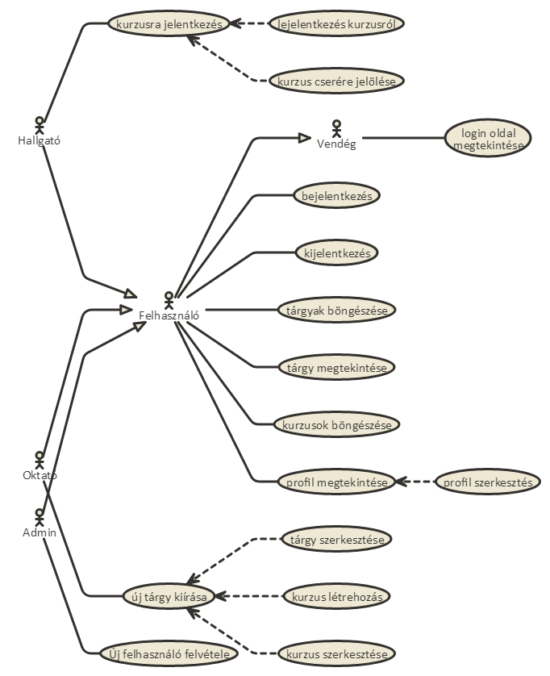

### 2.4. Folyamatok
* **Vendég:** 
  * bejelentkezés
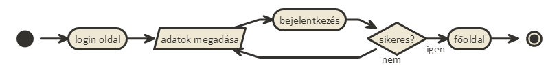

* Miden **bejelentkezett felhasználó** számára elérhető folyamatok:
  * Tárgy megtekint

* **Admin:** 
  * új felhasználó felvétele

* **Oktató:** 
  * új tárgy felvétele

  * tárgy szerkesztése
  
  
  * új kurzus
  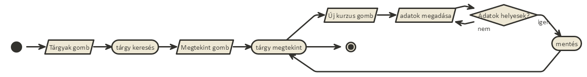
  
  * kurzus szerkesztése
  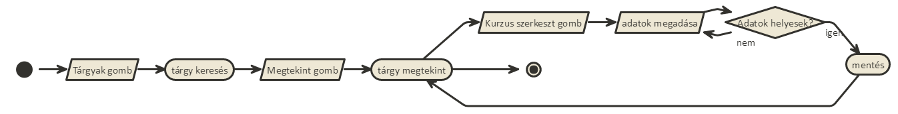
  
* **Hallgató**
  * Kurzus felvétele
  
  
  * Kurzus lead
  
  
  * Cserére jelöl
  
  
  * Csere elfogad:
  

##3. Tervezés
###3.1. Oldaltérkép
**Publikus**
- Bejelentkezés

**Bejelentkezett felhasználó:**
- Kilépés
- Profil
  + Profil szerkesztése
- Tárgyak listázása
  + Tárgy megtekintése
  
**Admin jogosultásggal elérhető még:**
- Új felhasználó felvétele

**Oktató jogosultásggal elérhető még:**
- Új tárgy felvétele
- Tárgyak listázása
  + Tárgy megtekintése
    * Új Kurzus
    * Kurzus szerkesztése
  + Tárgy szerkesztése
  
**Hallgató jogosultásggal elérhető még:**
- Tárgyak listázása
  + Tárgy megtekintése
    * Kurzus cserére jelöl
- Kurzus csere lehetőségek
      
### 3.2. Végpontok

* `GET '/'`: főoldal
* `GET '/subjects'`: tárgylista
* `POST '/subjects'`: tárgylista, filter adatok küldése
* `GET '/subject/:id'`: tárgy megtekintése
* `GET '/addsubject'`: új tárgy felvitele, űrlap megjelenítés
* `POST '/addsubject'`: új tárgy felvitele, adatok küldése
* `GET '/subject/:id/editsubject'`: tárgy szerkesztése, űrlap megjelenítés
* `POST '/subject/:id/editsubject'`: tárgy szerkesztése, adatok küldése
* `GET '/subject/:id/addcourse'`: új kurzus felvitele, űrlap megjelenítés
* `POST '/subject/:id/addcourse'`: új kurzus felvitele, adatok küldése
* `GET '/subject/:id/editcourse/:cid'`: kurzus szerkesztése, űrlap megjelenítés
* `POST '/subject/:id/editcourse/:cid'`: kurzus szerkesztése, adatok küldése
* `GET '/signup/:cid'`: kurzusra jelentkezés parancs
* `GET '/signdown/:cid'`: kurzusról lejelentkezés parancs
* `GET '/trade'`: kurzus cserére jelölése, űrlap megjelenítés
* `POST '/trade'`: kurzus cserére jelölése, adatok küldése
* `GET '/trades'`: csere ajánlatok listázása
* `GET '/deal'`: csere elfogadás parancs

* `GET '/registration'`: új felhasználó felvitele, űrlap megjelenítés
* `GET '/profile/edit'`: saját profil szerkesztése, űrlap megjelenítés
* `GET '/profile/show'`: profil megtekintése
* `POST '/profile/edit'`: saját profil szerkesztése, adatok küldése
* `POST '/registration'`: új felhasználó felvitele, adatok küldése
* `GET '/login'`: bejelentkező oldal
* `POST '/login'`: bejelentkezési adatok küldése
* `GET '/logout'`: kijelentkezés

### 3.3. Osztálydiagram

### 3.4. Adatbázisterv
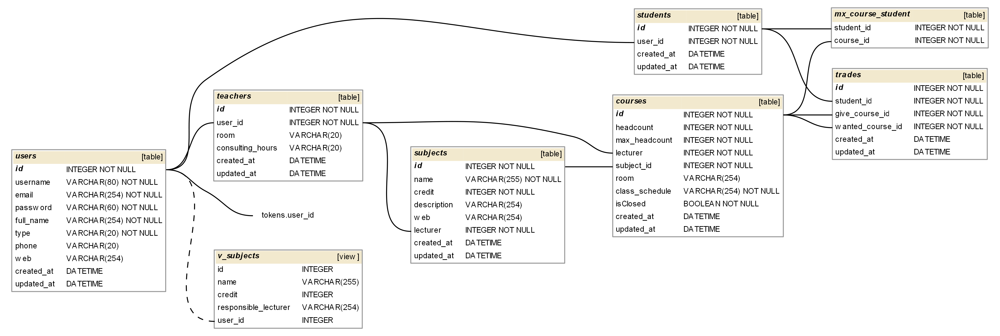

### 3.5. Oldalvázlatok

## Bejelentekés
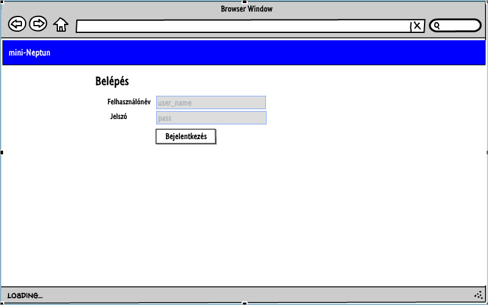

## Felhasználó rögzítése
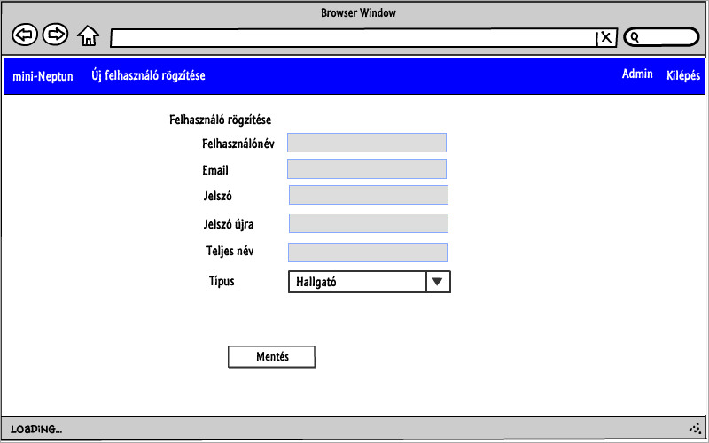

## Profil szerkesztése/megtekintése
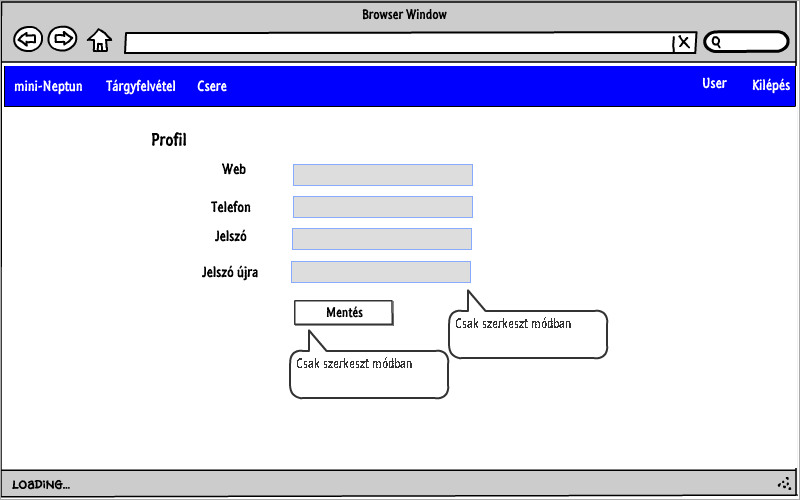

## Főoldal
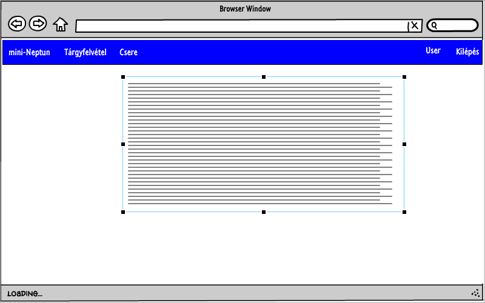

## Új tárgy rögzítése
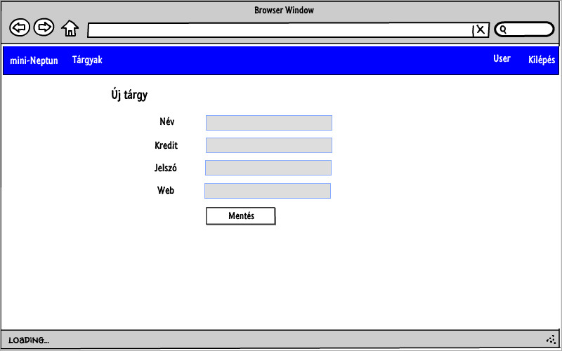

## Tárgyak listázása
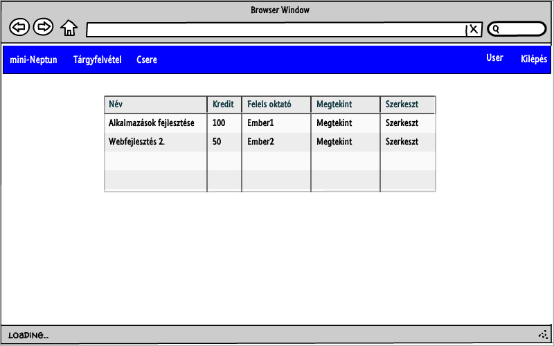

## Tárgy megtekintése
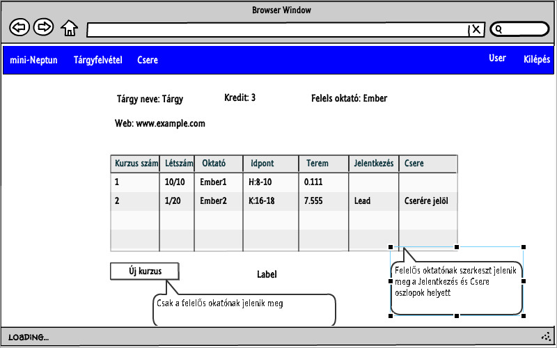

## Tárgy szerkesztése
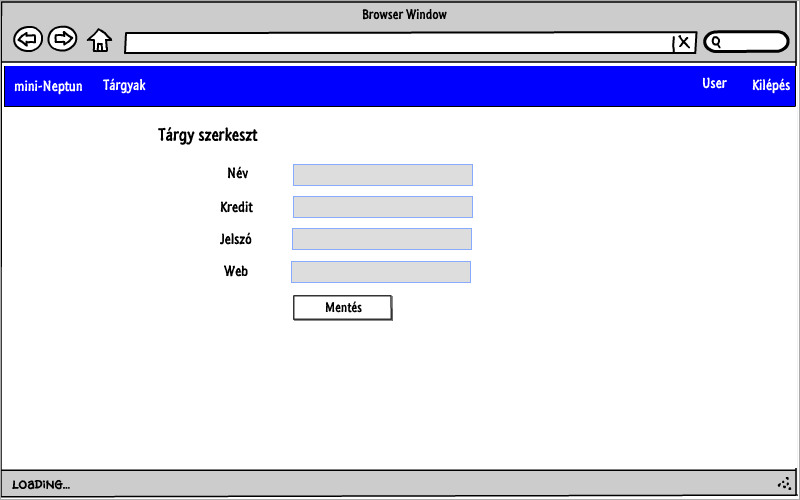

## Kurzus rögzítése
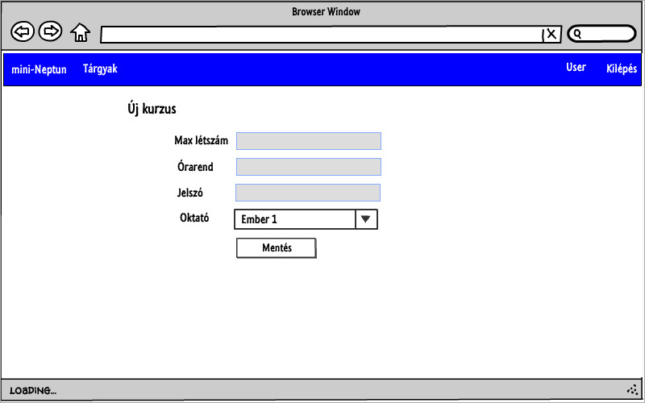

## Kurzus szerkeszt
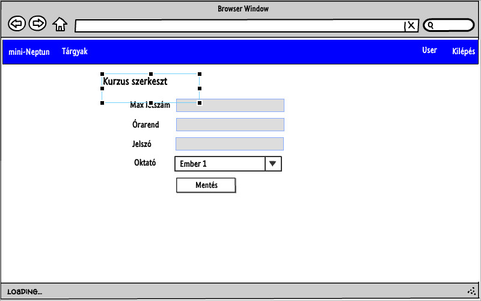

## Cserére jelöl
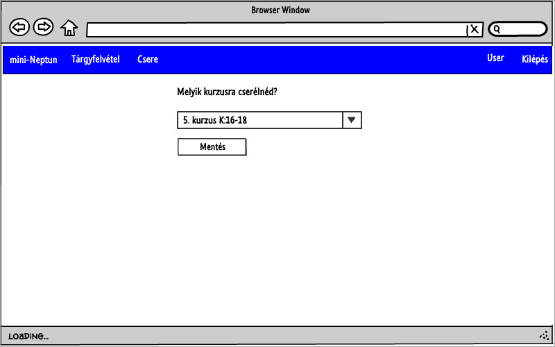

## Csere
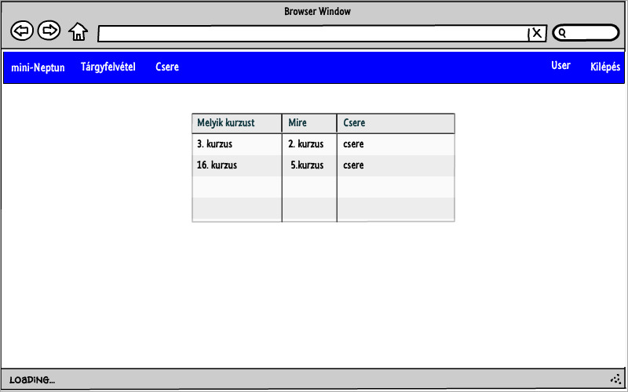

## 4. Telepítés
`git clone https://github.com/Bicz4477/mini-neptun.git`

`cd mini-neptun`

`npm install`

`mv .env.example .env`

`node --harmony_proxies ace migration:run`

`node --harmony_proxies ace db:seed`

alkalmazás indítása: `node --harmony_proxies server`

Alapértelmezett Admin felhasználó: felhasználónév: admin jelszó: alma

## 5. Implementáció
### 5.1 Fejlesztő eszközök
Az alkalmazás [Node.js](https://nodejs.org/)-re épülő [AdonisJs](https://adonisjs.com/) nevű keretrendszer és [Nunjucks](https://mozilla.github.io/nunjucks/) template engine segítségével készült. A fejlesztés [Visual Studio Code](https://code.visualstudio.com/), [Notepad++](https://notepad-plus-plus.org/), [SQlite Database Browser](http://sqlitebrowser.org/) szoftverekkel történt.

A dokumentáció [nomnoml](http://nomnoml.com/), [SchemaCrawler](http://sualeh.github.io/SchemaCrawler/) felhasználásával készült.

### 5.2 Könyvtárstruktúra
* app
  * Http
    * Controllers - MVC Vezérlő
    * Model - MVC Modell
* database - adatbázis fájl
  * seeds - adatbázis seedek
  * migrations - adatbázis migrációs scriptek
* public - képek, stíluslapok, scriptek helye
* resources
  * views - MVC Nézet
  
## 6. Tesztelés
### 6.1 Selenium IDE telepítése és indítása
0. Firefox [letöltése](https://www.mozilla.org/hu/firefox/new/), telepítése.
1. [Selenium IDE kiegészítő hozzáadása a Firefoxhoz](https://addons.mozilla.org/hu/firefox/addon/selenium-ide/).
2. Selenium IDE indítása: __Menü > Fejlesztő > Selenium IDE__ menüpont.
### 6.2 Selenium IDE teszt futtatása
1. A __Fájl > Open Test Suite__ menüpont választása után válaszuk ki a test/tests állományt.
2. A tesztek futtatásához válaszuk a __Play entire test siute__ vagy a __Actions > Play entire test siute__ menüpontot.
3. A tesztek sikeresen lefutottak, ha a failures melleti szám 0.

### 6.3 Tesztesetek
1. Felhasználók rögzítése
2. Új tárgy létrehozása
3. Tárgyfelvétel
4. Kurzuscsere

## 7. Futtatásához ajánlot hardver, szoftver
  * Szoftver: Modern webböngésző (Firefox 50, Chrome 55 vagy jobb).
  * Hardver: böngésző futtatásához szükséges hardver.

## 8. Alkalmazás használata
1. Új felhasználók felvétele:
  * Jelentkezzünk be az admin felhasználóval
  * A felső sávon válasszuk az "Új felhasználó rögzítése" menüpontot
  * Töltsük ki az űrlapot
  * Kattintsunk a "Mentés" gombra
2. Új tantárgy rögzítése
  * Jelentkezzünk be (csak tanár típusú felhasználóval lehetséges tantárgy rögzítése)
  * A felső sávon válasszuk az "Új tantárgy" menü pontot
  * Töltsük ki az űrlapot
  * Kattintsunk a "Mentés" gombra
3. Új kurzus rögzítése
  * Jelentkezzünk be (csak olyan tanár típusú felhasználóval lehetséges ez a művelet, amely létrehozta az adott tantárgyat)
  * A felső sávon válasszuk a "Tárgyak" menüpontot
  * Keresük meg a kívánt tantárgyat
  * Kattintsunk a tárgy sorában lévő szem ikonra
  * A "Tárgy kurzusai" panelon kattintsunk az "Új kurzus gombra" 
  * Töltsük ki az űrlapot
  * Kattintsunk a "Mentés" gombra
4. Tantárgy szerkesztése
  * Jelentkezzünk be (csak olyan tanár típusú felhasználóval lehetséges ez a művelet, amely létrehozta az adott tantárgyat)
  * A felső sávon válasszuk a "Tárgyak" menüpontot
  * Keresük meg a kívánt tantárgyat
  * Kattintsunk a tárgy sorában lévő ceruza ikonra 
  * Töltsük ki az űrlapot
  * Kattintsunk a "Mentés" gombra
5. Kurzus szerkesztése
  * Jelentkezzünk be (csak olyan tanár típusú felhasználóval lehetséges ez a művelet, amely létrehozta az adott tantárgyat)
  * A felső sávon válasszuk a "Tárgyak" menüpontot
  * Keresük meg a kívánt tantárgyat
  * Kattintsunk a tárgy sorában lévő szem ikonra
  * A "Tárgy kurzusai" panelon kattintsunk a ceruza ikonra a szerkeszteni kívánt kurzus mellet
  * Töltsük ki az űrlapot
  * Kattintsunk a "Mentés" gombra
6. Kurzus felvétele
  * Jelentkezzünk be
  * A felső sávon válasszuk a "Tárgyak" menüpontot
  * Keresük meg a kívánt tantárgyat
  * Kattintsunk a tárgy sorában lévő szem ikonra
  * A "Tárgy kurzusai" panelon kattintsunk a felvenni kívánt kurzus mellet a "Felvesz" gombra
7. Kurzus leadása
  * Jelentkezzünk be
  * A felső sávon válasszuk a "Tárgyak" menüpontot
  * Keresük meg a kívánt tantárgyat
  * Kattintsunk a tárgy sorában lévő szem ikonra
  * A "Tárgy kurzusai" panelon kattintsunk a leadni kívánt kurzus mellet a "Lead" gombra
8. Csere ajánlat létrehozása
  * Jelentkezzünk be
  * A felső sávon válasszuk a "Tárgyak" menüpontot
  * Keresük meg a kívánt tantárgyat
  * Kattintsunk a tárgy sorában lévő szem ikonra
  * A "Tárgy kurzusai" panelon kattintsunk a cserélni kívánt kurzus mellet a "Csere" gombra
  * Válasszuk ki a lenyíló mezőből a kívánt kurzust
  * Kattintsunk a "Mentés" gombra
9. Csere ajánlat elfogadás
  * Jelentkezzünk be
  * A felső sávon válasszuk a "Csere" menüpontot
  * Keressünk számunkra megfelelő csere ajánlatot
  * Kattintsunk a mellette található "Csere" gombra
10. Profil szerkesztése
  * Jelentkezzünk be
  * Kattintsunk a "Kijelentkezés" felirat mellet található (nevünket megjelenítő) feliratra
  * Kattintsunk a "Szerkeszt" gombra
  * Töltsük ki az űrlapot
  * Kattintsunk a "Mentés" gombra

## 9. Új funckciók (3. bead)
### 9.1 Megereősítő ablak
Tárgy leadás megereősítő ablak:
* Érintet fájlok
confirmDialog.js - új fájl
subjects.njk - a fájl végére bekerült a modális ablak megjelenését leíró html
* Működés
Amikor a "Lead" gombra kattintunk, akkor a `confirmDialog.js`-ben található script fut le, melynek hatására a link nem irányít át a másik oldalra, helyette megjelenik a megerősítést kérő ablak.

### 9.2 Űrlap validáció
* Érintet fájlok
urlValidation.js - új fájl
profile.njk - script include
editsubject.njk - script include
addsubject.njk - script include
* Működés
Amikor az űrlapot megpróbáljuk elküldeni, akkor fut le a `urlValidation.js`-ben található script, mely lényegében egy url validációs script. A script megvizsgálja, hogy az input `http://`-vel kezdődik-e, ha nem hozzáfűzi az elejére, majd egy reguláris kifejezéssel, megvizsgálja az url-t, ha az url helyes elküldi a formot, amit a szerver feldolgozhat utánna, ha helytelen volt az url, akkor `event.preventDefault();` megakadályozza, hogy elküldje a formot a kliens, majd az utána következő sor megjelöli a formon a hibás részt.

### 9.3 Keresési javaslatok
* Érintet fájlok
search.js - új fájl
NeptunController.js - ajaxSearch(...) függvény
routes.js - /ajax/search végpont
search.css - ajánló panel stílusát tartalmazza
subjects.njk - egy új div amibe az ajánlások fognak kerülni
* Működés
A kereső mezőbe történő gépelés hatására fut le a `search.js`-ben lévő script, amely egy GET eljárás segítségével elküldi a szervernek a keresőmezőbe lévő kifejezést. Ennek hatására `NeptunController.js`-ben található `ajaxSearch` függvényében a szerver megvizsgálja az inputot, majd ezután az adatbázisból lekérdezi a sorokat az inputot felhasználva mint feltétel, ezután visszatérünk a `search.js`-be, ahol a script a visszakapott adatokból elkészíti a linkeket, majd a linkeket betölti a html oldal megfelelő részébe.

### 9.4 Kurzus felvétel/leadás
A kurzus felvétel, leadás működése nagyon hasonló, ezért csak a felvételről lesz szó.
* Érintet fájlok
NeptunController.js - ajaxSigndown(...), ajaxSignup függvény
ajaxCourseHandling.js - új fájl
routes.js - ajax/signup, ajax/signdown végpontok
* Működés
Mikor rákattintunk a "Felvesz" linkre, akkor az `ajaxCourseHandling.js`-ben lévő script kezd el lefutni, amely kezdésként megakadályozza a link működését, majd egy POST metódus küld a szervernek a felvenni kívánt kurzus id-vel, a szerver feldolgozza a kérést a `ajaxSignup` függvényben, amely működése megegyezik a nem ajaxos `signup` működésével. A szerver elvégzi a szükséges adatbázis műveleteket( csökkenti a férőhelyek számát, összekapcsolja a kurzus és diák egyedeket), majd egy JSON objektumot küld vissza, amely egyetlen success nevű mezőt tartalmaz, amelynek értéke igaz, ha a művelet probléma nélkül befejeződött. Ennek hatására a script( ha minden hiba mentesen megtörtént) frissíti a kurzusokat megjelenítő táblázatott, hogy a felhasználó számára az aktuális adatok jelenjenek meg. 

### 9.5 Csere elfogadás
* Érintet fájlok
trades.njk - script include és hiba esetén felugró modális ablak
routes.js - /ajax/deal végpont
ajaxDeal.js - új fájl
NeptunController.js - ajaxDeal(...) függvény
* Működés
Mikor a "Csere" gombra kattintunk egy modális ablak ugrik fel megerősítést kérve és közben egy script is lefut, a `ajaxDeal.js`-ben található második függvény, amely beállítja az id nevű globális változóba a csere ajánlat id-t. Miután a modális ablakon is megerősítettük csere szándékunkat `ajaxDeal.js`-ben található első függvény fut le, amely egy POST eljárást küld a szervernek a csere ajánlat id-vel. A szerver megkeresi a cserét, elvégzi a szükséges adatbázis műveleteket( megcseréli a megfelelő kurzusokat, törli a csere ajánlatot), majd ha minden hiba nélkül lefutott, akkor egy JSON objektumot küld vissza, amely egy success mezőt tartalmaz (hiba esetén a mező értéke false). Hiba esetén egy modális ablak jelenik meg, amely közli a felhasználóval a hibát, majd újra tölti a script a csere ajánlatokat tartalmazó táblát. Sikeres csere esetén csak a táblázat újra töltése történik meg.

## 10. Szekvencia diagram
Tárgyfelvétel szekvencia diagramja:
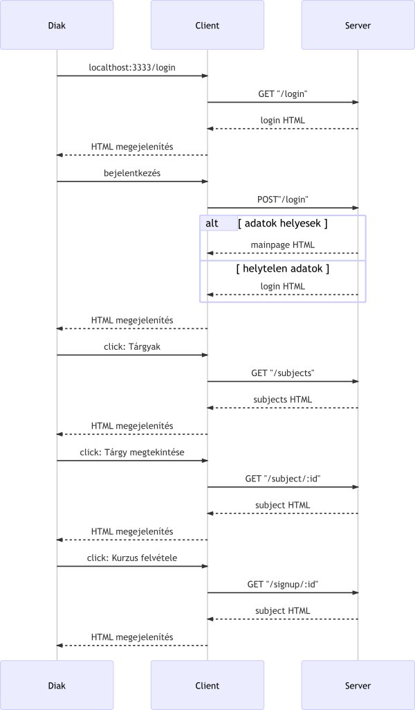

## 11. 2.bead pótlásait
A 2. beadandó pótlásait ez a commit tartalmazza: [link](https://github.com/Bicz4477/mini-neptun/commit/fece0236eefbed9d23b3afc917e24c29b77194f8)